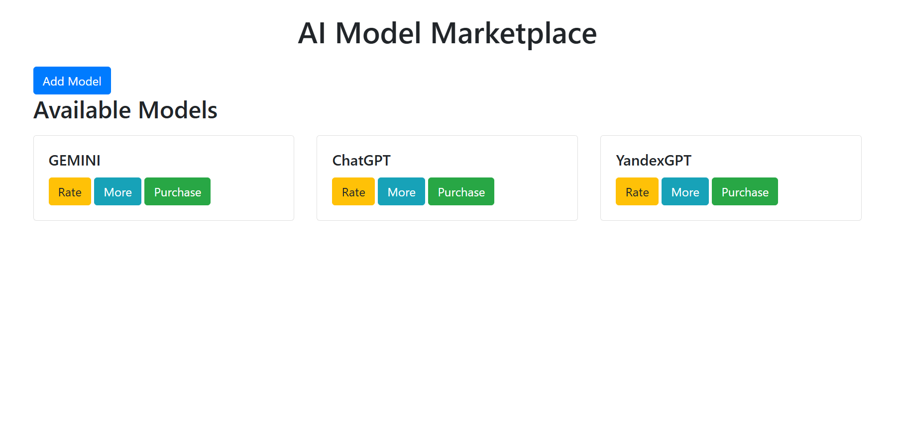

# AI Model Marketplace

AI Model Marketplace is a decentralized platform where users can list, purchase, and rate AI models. The project is built on the Ethereum blockchain using smart contracts, and it allows creators to sell their AI models, while buyers can purchase and rate them.

## Features
- **List AI Models**: Creators can list their AI models with details like name, description, and price.
- **Purchase AI Models**: Buyers can purchase listed AI models using Ether.
- **Rate AI Models**: Buyers can rate models after purchase, and the rating is reflected in the marketplace.
  
## Technologies Used
- **Solidity**: For writing smart contracts.
- **Web3.js**: For interacting with Ethereum smart contracts from the frontend.
- **Bootstrap**: For responsive design and UI components.

## Installation and Usage

### Prerequisites
- [MetaMask](https://metamask.io/) extension installed in your browser.
- Sepolia test network configured in MetaMask.
- Ethereum test Ether in your MetaMask wallet.

### Steps to Run the Project:
1. Clone the repository:
   ```bash
   git clone <your-repo-link>
   cd AI-Model-Marketplace
   ```

2. Open `index.html` in your browser.

3. Make sure your MetaMask is connected to the Sepolia Testnet.

4. Interact with the marketplace by adding models, purchasing, and rating.

## Smart Contracts
The smart contract for the AI Model Marketplace is written in Solidity and deployed on the Sepolia testnet. The contract includes functionality to:
- List models.
- Purchase models.
- Rate models.
- Withdraw funds.

## Screenshots

### Marketplace Interface


### Add Model Form


### Rate Model


## Examples
### Listing a Model
To list a new AI model, click on "Add Model," fill in the details (name, description, price), and click "Save Model."

### Purchasing a Model
After browsing available models, click "Purchase" next to the desired model. Ensure you have enough Ether in your wallet.

### Rating a Model
After purchasing a model, you can rate it by clicking on the rating button under the model’s details.

## License

This project is licensed under the MIT License. See the [LICENSE](LICENSE) file for details.
